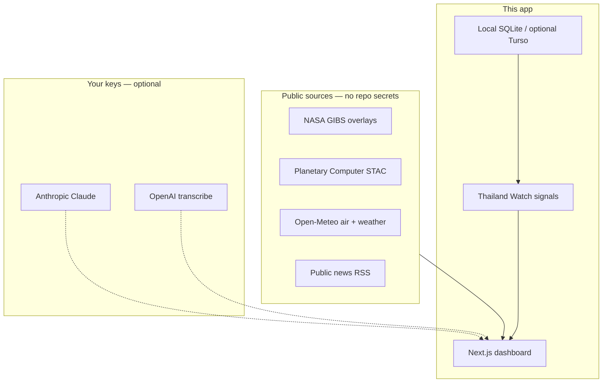

# DrNon — Thailand Watch Intelligence Dashboard

[](LICENSE)
[](package.json)

**A satellite-powered civic intelligence platform built by [Non Arkaraprasertkul](https://github.com/Nonarkara) / [Axiom X Co., Ltd.](https://axiom.nonarkara.org).**

Live: [non69.onrender.com](https://non69.onrender.com)

This repository is **independent studio software**. It is not an official product of Thailand's Digital Economy Promotion Agency (depa), NASA, Anthropic, or any Thai ministry or municipality. Affiliation, day jobs, and public talks do not make this GitHub project an agency system.

[Clone → env → run](#clone--env--run) · [Philosophy](#philosophy) · [Ethical use](#ethical-use) · [How it works](#how-it-works) · [Contributing](CONTRIBUTING.md) · [Security](SECURITY.md) · [License](#license)

---

## What This Is

DrNon is a real-time intelligence dashboard that monitors Thailand's civic infrastructure — air quality, heat stress, flood risk, transit, safety, and public service reliability — through curated signals, satellite imagery, live environmental data, and Claude-powered analysis.

It is not a news aggregator. It is not a data dump. It is an **intelligence product** — every signal is curated by a domain expert, every analysis is synthesized by Claude Opus, and every prediction is tracked for accountability.

---

## Philosophy

The in-app manifesto lives at [`/philosophy`](https://non69.onrender.com/philosophy). The short version for a stranger cloning this repo:

- **Cities are for people, not prestige.** Start from lived friction — air, heat, floods, transit, broken service — not vanity metrics.
- **Policy without product is theater.** A working dashboard argues harder than a slide deck.
- **Open source or shut up.** If a public-interest system cannot be rebuilt after a breach or a political tantrum, it is not serious.
- **Two root problems.** Miscommunication and illogical thinking. Every analysis is filtered through that lens.

Nonisms on the dashboard are decision fragments, not decorative quotes:

> *"The power of logic is limitless. Sometimes the will alone cannot save you from yourself, but the power of logic will."*

> *"We could live in a much better world if we can solve two problems: miscommunication and illogical thinking."*

---

## Ethical use

**Do**

- Treat Watch signals as **curated intelligence**, not official alerts. Cross-check TMD, DDPM, Air4Thai, police, and city channels before you act.
- Label AI output as synthesized analysis. Claude correlates context; it does not speak for the Thai state.
- Keep NASA GIBS, Open-Meteo, STAC, and RSS attribution visible when you fork the map or feeds.
- Put operator keys only in `.env.local`. Copy [`.env.local.example`](.env.local.example). Never commit secrets.

**Do not**

- Present this repo or the Render URL as an official depa, Smart City Thailand, NASA, or municipal operations system.
- Ship a fork that only boots if a stranger pastes your API key.
- Treat morning briefs, predictions, or meeting-mode notes as legal, medical, or emergency authority.
- Commit `.env`, `.env.local`, tokens, session cookies, or production databases.

If a change would only work by pasting a secret, it does not belong here.

---

## How it works



| Layer | Default on a fresh clone |
|-------|--------------------------|
| Watch UI, seed signals, Nonisms | Local SQLite (`file:db/non69.db`) — no key |
| Maps + satellite overlays | NASA GIBS / Leaflet — public tiles |
| Live air + weather | Open-Meteo — public API |
| News ticker | Public RSS |
| Analysis terminal, morning brief, Think / Communicate / Reflect, Challenge, Arena, Simulate | Needs **your** `ANTHROPIC_API_KEY` |
| Meeting transcription | Needs **your** `OPENAI_API_KEY` |

---

## Clone → env → run

No secrets are required to browse Thailand Watch.

```bash
git clone https://github.com/Nonarkara/non69.git
cd non69
npm install
cp .env.local.example .env.local
npm run seed
npm run dev
```

Open [http://localhost:3000/watch](http://localhost:3000/watch).

Leave `.env.local` empty to use the curated signals, map overlays, Open-Meteo, and RSS. Add `ANTHROPIC_API_KEY` only if you want Claude analysis and practice tools. First page load also initializes an empty local database if you skipped `npm run seed`.

Node 20+ recommended. Do not copy anyone else's keys into this file.

## Environment Variables

Names only. Values stay on your machine.

| Variable | Required to browse Watch? | Description |
|----------|---------------------------|-------------|
| `ANTHROPIC_API_KEY` | No | Claude API key for analysis, briefs, and practice tools |
| `ANTHROPIC_MODEL` | No | Optional model override (default Claude Opus) |
| `OPENAI_API_KEY` | No | Meeting transcription / search helpers |
| `JWT_SECRET` | No locally | Auth token secret; set a long random value before production |
| `TURSO_DATABASE_URL` | No | Hosted LibSQL URL; default is `file:db/non69.db` |
| `TURSO_AUTH_TOKEN` | No | Turso auth token, only with a hosted URL |

---

## Why This Is Better Than WorldMonitor

[WorldMonitor](https://github.com/koala73/worldmonitor) is an impressive open-source intelligence dashboard — 435+ news feeds, 92 stock exchanges, 45+ map layers, 111 panel types. It deserves respect as an engineering achievement. But engineering is not intelligence. Here is where DrNon diverges:

### 1. WorldMonitor Has No Brain. DrNon Has Claude Opus.

WorldMonitor aggregates data. It uses Ollama (local LLMs) and Groq for basic summarization — models that cannot reason across domains, hold long context, or generate original analysis.

DrNon uses **Claude Opus 4.6** with full context injection — every query to the analysis terminal includes the current watch state, live air quality, weather, satellite metadata, recent news, and the system's own prior predictions. Claude doesn't summarize. It **correlates**: fire detections with air quality degradation, precipitation patterns with flood risk, vegetation stress with heat indices, night light changes with economic activity.

The difference between a search engine and an analyst.

### 2. WorldMonitor Has No Opinion. DrNon Has a Lens.

WorldMonitor shows you 435 feeds and walks away. You stare at data and hope insight emerges. This is the Bloomberg Terminal fallacy — more data does not mean better decisions.

DrNon has an editorial voice. Every signal ends with **"Why it matters"** and **"What to do."** The morning brief doesn't list headlines — it tells you what changed, what it means, and what action to take. The system is built on Dr. Non's framework: the two root causes of all problems are **miscommunication** and **illogical thinking**. Every analysis is filtered through that lens.

A dashboard without a point of view is furniture.

### 3. WorldMonitor Has No Memory. DrNon Tracks Predictions.

WorldMonitor forgets everything the moment you close the tab. There is no institutional memory, no prediction tracking, no proof of work.

DrNon has an **intelligence memory system**:
- Every analysis is logged with its full context
- Predictions are automatically extracted and tagged with confidence levels
- Predictions are tracked as `open`, `confirmed`, `refuted`, or `expired`
- Past predictions are injected into future analyses so Claude can reference and validate its own prior claims

This means DrNon can say: *"I predicted this 12 days ago — it just happened."* That is the difference between a tool and an institution.

### 4. WorldMonitor Goes Wide. DrNon Goes Deep.

WorldMonitor monitors 195 countries across 15 categories. The result: it knows nothing well. Every country gets the same shallow treatment — a few RSS feeds, some market data, a Wikipedia-level country profile.

DrNon monitors **Thailand's 77 provinces** with the depth of someone who has managed 120+ smart city projects across every one of them. The creator (Dr. Non Arkara) is a Senior Expert at Thailand's Digital Economy Promotion Agency, a Harvard-trained anthropologist, and an MIT-trained architect. The signals aren't scraped from RSS — they're curated by someone who understands why Bangkok's civic complaint system breaks down in high-density districts and how PM2.5 correlates with agricultural burning cycles in the central plains.

One country monitored by an expert beats 195 countries monitored by a scraper. That day job is context for the curation, **not** a claim that this repo is a depa product.

### 5. WorldMonitor Is Passive. DrNon Has Action Tools.

WorldMonitor is a read-only dashboard. You look at it. That's the entire interaction model.

DrNon includes **active intelligence tools**:
- **Think Mode** — Socratic dialogue with Claude to stress-test your reasoning
- **Communicate Mode** — Practice delivering difficult messages with AI feedback
- **Reflect Mode** — Structured reflection on decisions and outcomes
- **Daily Challenge** — Logic and communication challenges with streak tracking
- **Debate Arena** — Argue both sides of a proposition
- **Conversation Simulator** — Practice high-stakes conversations before they happen
- **Meeting Mode** — Real-time meeting intelligence with source-backed interventions

These tools don't just show you the world — they make you sharper at operating in it.

### 6. WorldMonitor Has No Satellite Intelligence Layer.

WorldMonitor uses map layers for visualization — military bases, submarine cables, flight paths. These are static data overlays, not satellite intelligence.

DrNon integrates **12 NASA GIBS satellite overlays** (VIIRS True Color, MODIS imagery, fire/thermal detection, precipitation, aerosol optical depth, vegetation index, sea surface temperature, night lights) — all toggleable in real-time on an interactive map. It also queries the **STAC catalog** (Microsoft Planetary Computer) for the latest Sentinel-2 and Landsat imagery, with cloud cover filtering and freshness scoring.

Satellite data isn't decoration. It's ground truth that validates or contradicts every other signal. NASA imagery does not make this an official NASA product.

### 7. WorldMonitor Has No Morning Brief.

WorldMonitor expects you to synthesize 435 feeds yourself every morning. That is not intelligence — that is homework.

DrNon generates a **structured daily intelligence brief** with one click:
- **Headline** — one-line posture assessment
- **Executive Summary** — 3-4 sentences on what matters today
- **Satellite Intelligence** — what the imagery shows
- **Signals Update** — status changes across all civic signals
- **Cross-Domain Correlations** — connections between data sources
- **Predictions** — forward-looking statements (tracked for accountability)
- **Recommended Actions** — what to do today

You wake up to intelligence, not information.

### 8. WorldMonitor Has No Philosophy.

WorldMonitor is a tool. DrNon is a manifesto. A dashboard without philosophy is just a screen. A dashboard with philosophy is a way of seeing.

---

## Architecture

| Layer | Technology |
|-------|-----------|
| Frontend | Next.js 16, React 19, TypeScript, Tailwind |
| Maps | Leaflet + NASA GIBS WMTS + ArcGIS Satellite |
| Satellite | STAC (Planetary Computer), 12 GIBS overlays |
| AI | Claude Opus 4.6 (Anthropic SDK), streaming SSE |
| Database | SQLite via LibSQL (`better` local file or optional Turso) |
| Live Data | Open-Meteo (air quality, weather), RSS feeds |
| Auth | JWT + bcrypt, cookie-based sessions |
| Deployment | Render (web service) |

## Features

- **Thailand Watch** — 6 curated civic signals with status, metrics, trends, sources
- **Satellite Overlays** — 12 NASA GIBS layers (fire, weather, vegetation, night lights, imagery)
- **STAC Integration** — Query Planetary Computer for Sentinel-2/Landsat imagery
- **Claude Analysis Terminal** — Ad-hoc intelligence queries with full context injection
- **Morning Brief Generator** — Streaming daily intelligence product
- **Intelligence Memory** — Prediction tracking with confirmation/refutation
- **Narrative Engine** — Cross-signal correlation (fire+air, rain+floods, vegetation+heat)
- **Cockpit + Wallboard** — CMD scene (map-centric cockpit) + WALL scene (ambient display)
- **Practice Tools** — Think, Communicate, Reflect, Challenge, Arena, Simulator
- **Meeting Mode** — Real-time meeting intelligence with source-backed responses
- **Watch Ops** — Revision history, publish/rollback, freshness tracking
- **Share Engine** — Share signals and briefs to X, LinkedIn, or clipboard

## The Person Behind This

**Dr. Non Arkaraprasertkul, PhD** — [Axiom X Co., Ltd.](https://axiom.nonarkara.org), Bangkok
- Harvard (Anthropology), MIT (Architecture), Oxford (Modern Chinese Studies)
- Senior Expert, Smart City Promotion — Thailand's Digital Economy Promotion Agency (depa)
- 120+ tech projects across all 77 Thai provinces
- Keynote speaker at 100+ global forums
- Life mission: solve miscommunication and illogical thinking at scale

This is not a side project. This is the operating system for a life's work — published here as independent software, not as an agency release.

---

## License

MIT — Copyright (c) 2026 Non Arkaraprasertkul / Axiom X Co., Ltd. See [LICENSE](LICENSE).

Contributions: [CONTRIBUTING.md](CONTRIBUTING.md). Vulnerabilities: [SECURITY.md](SECURITY.md).

---

*Built with Claude Opus 4.6. Not by AI — with AI.*
